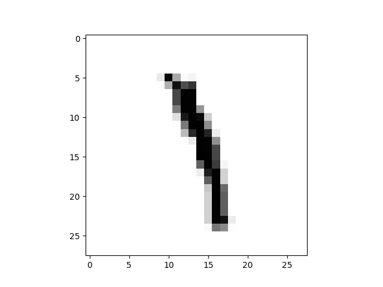
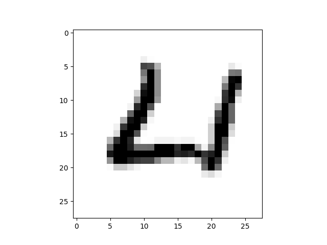
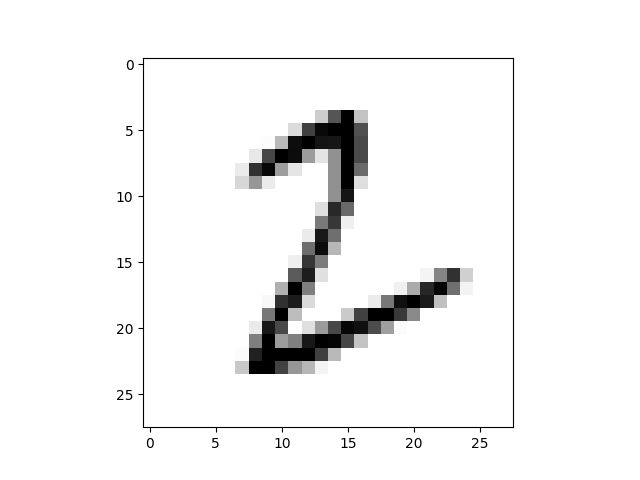

### Train the neural net with original hyperparameters

**Hyperparameters**

```
layers of the network : 3
number of neurons in each layer : (784, 10, 10)
epochs = 10
mini_batch_size = 10
eta(learning rate) = 0.1
```

**Result**

```
Initial performance : 1099 / 10000
Epoch 0 : 4054 / 10000
Epoch 1 : 5906 / 10000
Epoch 2 : 6762 / 10000
Epoch 3 : 7644 / 10000
Epoch 4 : 7943 / 10000
Epoch 5 : 8150 / 10000
Epoch 6 : 8291 / 10000
Epoch 7 : 8389 / 10000
Epoch 8 : 8437 / 10000
Epoch 9 : 8514 / 10000
```

### Experiment by adjusting the hyperparameters

#### First version

**Hyperparameters**

```
layers of the network : 3
number of neurons in each layer : (784, 16, 10)
epochs = 10
mini_batch_size = 10
eta(learning rate) = 0.1
```

**Result**

```
Initial performance : 1041 / 10000
Epoch 0 : 5452 / 10000
Epoch 1 : 7046 / 10000
Epoch 2 : 7722 / 10000
Epoch 3 : 8097 / 10000
Epoch 4 : 8315 / 10000
Epoch 5 : 8479 / 10000
Epoch 6 : 8593 / 10000
Epoch 7 : 8656 / 10000
Epoch 8 : 8691 / 10000
Epoch 9 : 8743 / 10000
```

**Change & Reason**

```
In this version, I just add the number of neurons of the hidden layer,
as more neurons can learn more features,
so the accuracy becomes higher than less neurons. 
```

#### Second version (Optimal)

**Hyperparameters**

```
layers of the network : 3
number of neurons in each layer : (784, 30, 10)
epochs = 20
mini_batch_size = 10
eta(learning rate) = 3
```

**Result**

```
Initial performance : 1232 / 10000
Epoch 0 : 9103 / 10000
Epoch 1 : 9268 / 10000
Epoch 2 : 9294 / 10000
Epoch 3 : 9370 / 10000
Epoch 4 : 9409 / 10000
Epoch 5 : 9423 / 10000
Epoch 6 : 9418 / 10000
Epoch 7 : 9446 / 10000
Epoch 8 : 9456 / 10000
Epoch 9 : 9478 / 10000
Epoch 10 : 9475 / 10000
Epoch 11 : 9501 / 10000
Epoch 12 : 9514 / 10000
Epoch 13 : 9499 / 10000
Epoch 14 : 9487 / 10000
Epoch 15 : 9472 / 10000
Epoch 16 : 9498 / 10000
Epoch 17 : 9498 / 10000
Epoch 18 : 9490 / 10000
Epoch 19 : 9508 / 10000

the time required to train the net : 188.19 s
```

**Change & Reason**

```
This time I change the epoch, number of neurons of hidden layber and learning rate.
Because the accuracy of the test images keep increasing during training, it means that increasing the number of epoch can improve the performance of network.
Then I choose a bigger learning rate to improve convergence speed.
I change the number of neurons in hidden layer too, the reason is the same as the previous one.
```

**wrong predict**

<center class="half">



<center>


```
the left one,   predict 9 real 1
the middle one, predict 6 real 4
the right one,  predict 3 real 2
```

